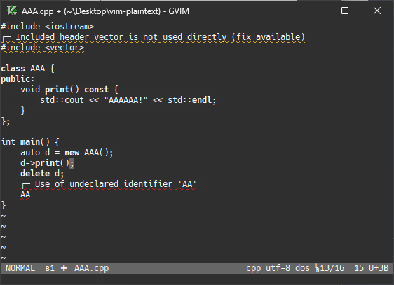
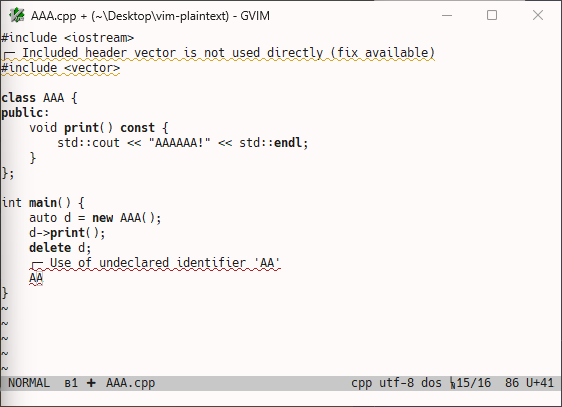

# vim-plaintext
A clean theme based on notebook paper tones.

## Screenshots

| Dark | Light |
|:----------:|:-----------:|
|  |  |

## License

All source code in this repository is licensed under the MIT License,
unless stated otherwise. A copy of this license can be found in the
file "LICENSE".
